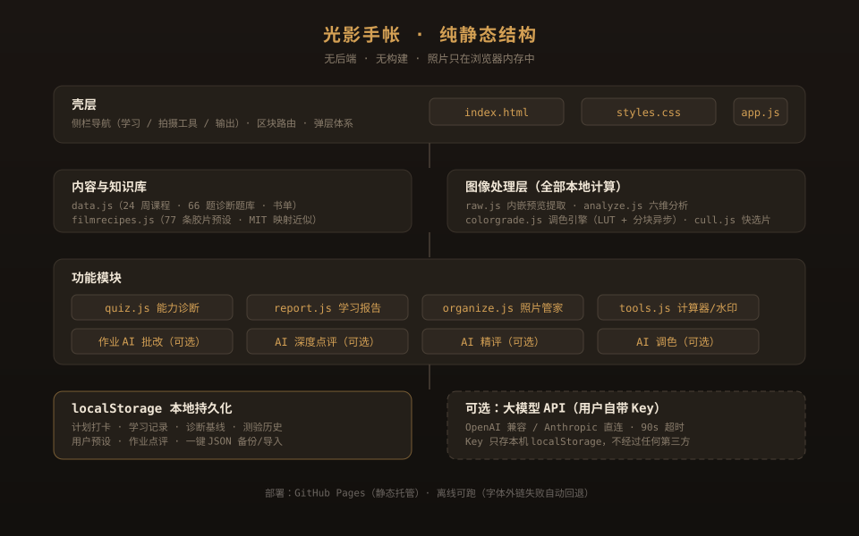

# 光影手帐

> 一个纯静态的摄影「训练 + 创作」工具站：把相机从自动挡解放出来，再把照片拍到能看。

**在线使用**：<https://minghe-lgt.github.io/xiangji/>（免安装，打开即用）

## 这是干什么的

面向摄影新手的完整训练与工作台。左边是一条**六阶段 24 周训练体系**（理论 → 实拍任务 → 自检 → 延伸阅读 → AI 作业批改），右边是一组**真用的拍摄与出片工具**——两者共用一套照片分析引擎。

- **学**：24 周课程打卡、能力诊断（66 题均衡抽题）、学习报告、书单课单（每周配原创「读时抓重点」与 2–3 张示例图）
- **拍**：曝光三角/景深/ND/黄金时刻计算器、照片管家（EXIF 识别 + 自动改名）
- **修**：调色工作台（曲线/HSL/局部蒙版/颗粒光晕，107+ 预设，AI 按意图出参）、千张级快选片（本地初筛 + AI 精评）
- **出**：水印批量导出、九宫格组照、学习报告导出

## 结构



11 个全局脚本、无打包器、无后端，加载顺序见 `index.html`。所有照片处理都在浏览器内存里完成，**照片永不上传**；学习进度存于本机 localStorage，支持一键 JSON 备份/导入。

课程例图放在 `examples/`（24 周 × 2–3 张，共 52 张），随页面懒加载、单图加载失败自动隐藏。图片来自 [Unsplash](https://unsplash.com/license)（免费授权，可自由使用与修改），不存在版权风险；在站点「书单课单」页也有来源说明。

## 快速开始

```bash
git clone https://github.com/minghe-lgt/xiangji.git
# 直接双击 index.html，或起个静态服务：
py -m http.server 8000
```

无需安装任何依赖。AI 相关功能（深度点评 / 精评 / 作业批改 / 按意图调色）全部可选——在「调色工作台 → 厂商设置」填入自己的大模型 Key 即可启用，不填不影响任何本地功能。

## 技术要点

- 纯 HTML/CSS/JS，零依赖、零构建，GitHub Pages 直接托管
- 调色引擎：256 项 LUT 预计算 + 按行带分块的异步渲染（导出不冻结界面，带进度）
- RAW 支持：提取内嵌 JPEG 预览（ARW/CR2/NEF/DNG 等），标注有损
- 快选片：千张级缩略图、`content-visibility` 跳过视口外渲染、3 路并发 AI 精评
- 无障碍与降级：字体外链失败自动回退；未配置 Key 时所有本地功能完整可用
